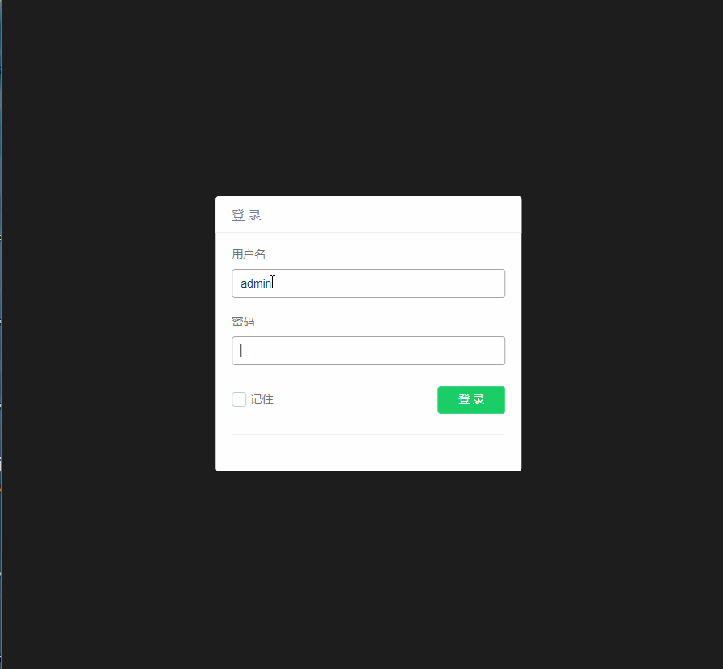
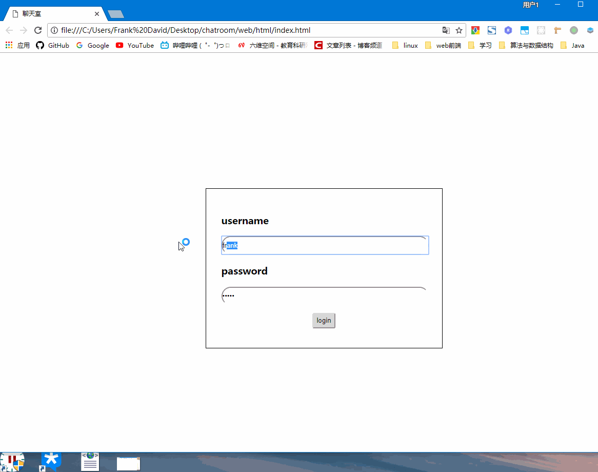

# ChatRoom
# A realtime text chatroom based on mqtt
## Usage
- 1.Download emqtt server from the [official website](http://emqtt.com/downloads).Copy the config file to emqtt/etc then start the emqtt server.
```
./bin/emqttd start
./bin/emqttd_ctl plugins load emq_auth_http
./bin/emqttd_ctl plugins load emq_web_hook
```
You will see the mqtt server state from the `localhost:18083`with username `admin` password `public`   

- 2.Start the springboot server.(Make sure you have installed `maven`)
```
mvn spring-boot:run
```
- 3.Open the `web/html/index.html` (just double click) and login,there are already 3 users in the db:
```
| username | password | rooms |
| -------- | -------- | ----- |
| frank | 12345 | 1 2 3 |
| david | 12345 | 1 2 |
| claire | 12345 | 1 3 |
```  

## Extend
You can add the interfaces with function create and manager the users and rooms, just manage the h2db table `user` & `room`. 
## Notice
- It is a plain text chatroom. Image and file is illegal. 
- It is a simple chatroom, so the history message won't be saved.